# Festum

Festum is a Flutter mobile application for event services discovery, booking, and provider operations. The project includes two connected experiences: a client flow for browsing and ordering services, and a provider flow for managing business information, services, products, reservations, and notifications.

## Product Scope

- Client catalog with category-based discovery
- Service detail pages with gallery, pricing, and cart actions
- Cart, order tracking, and order detail timeline
- Provider dashboard with quick stats and featured services
- Service and product management for providers
- Reservation review, manual booking, and booking detail flows
- Shared visual system for Android and iOS

## Screenshots

### Provider Experience

<table>
  <tr>
    <td align="center">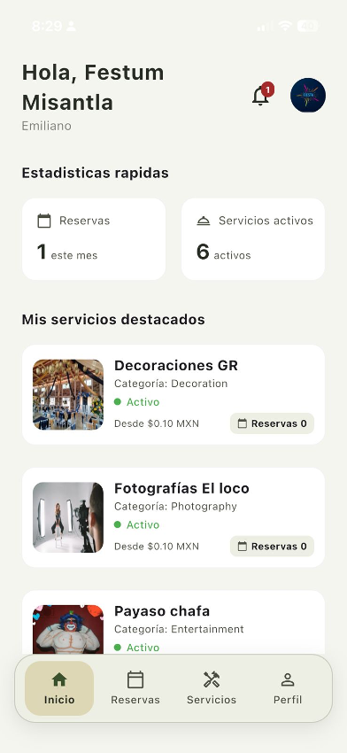<br>Provider home</td>
    <td align="center">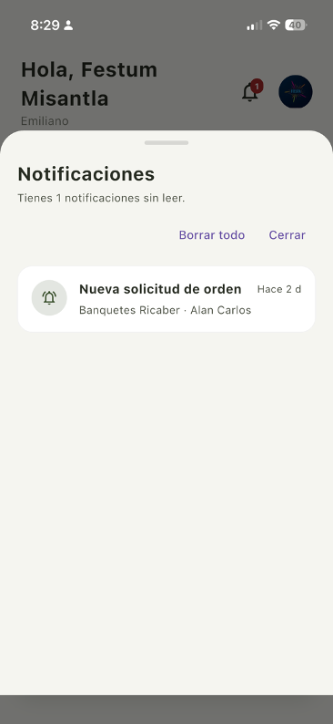<br>Notifications</td>
    <td align="center">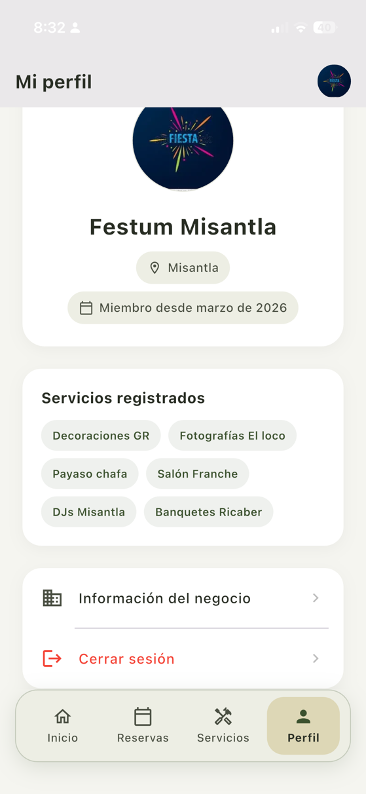<br>Profile</td>
  </tr>
  <tr>
    <td align="center">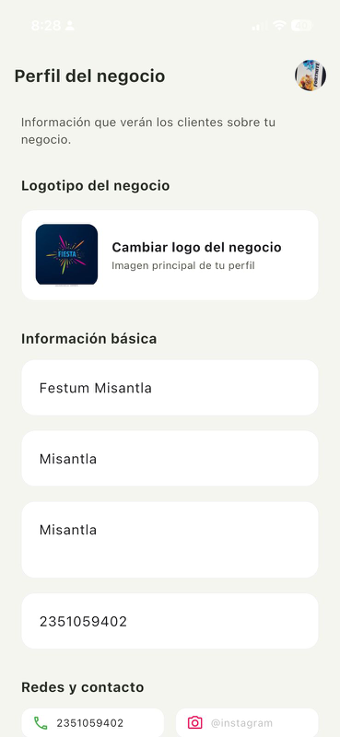<br>Business profile</td>
    <td align="center">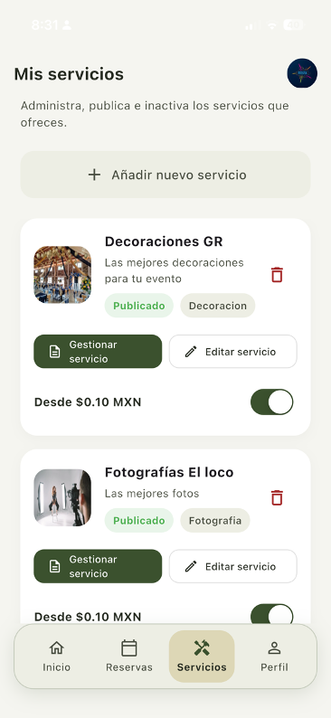<br>Services</td>
    <td align="center">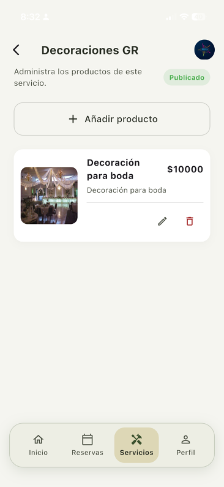<br>Products</td>
  </tr>
  <tr>
    <td align="center">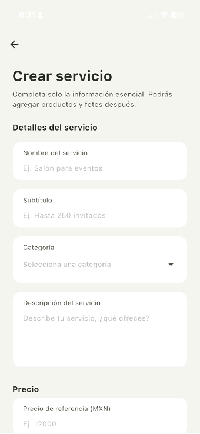<br>Create service</td>
    <td align="center">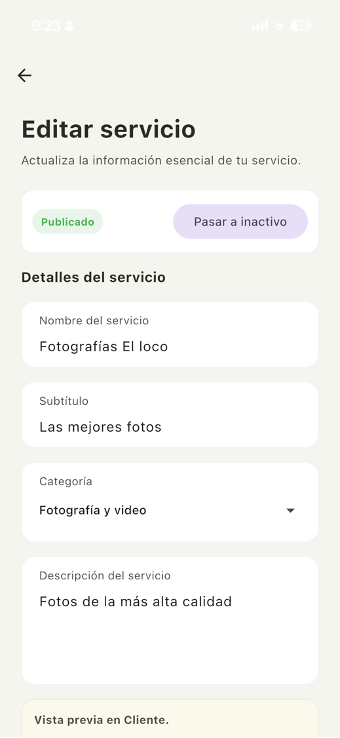<br>Edit service</td>
    <td align="center">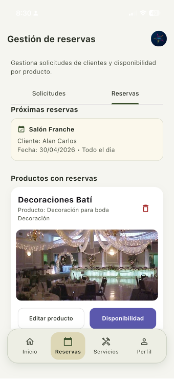<br>Reservations</td>
  </tr>
  <tr>
    <td align="center">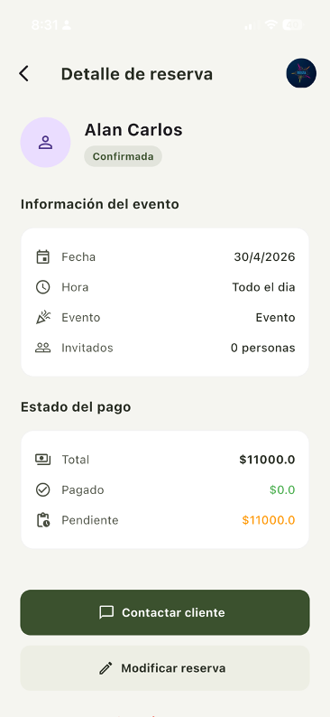<br>Booking detail</td>
    <td></td>
    <td></td>
  </tr>
</table>

### Client Experience

<table>
  <tr>
    <td align="center">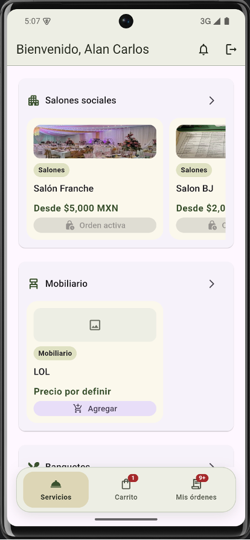<br>Client home</td>
    <td align="center">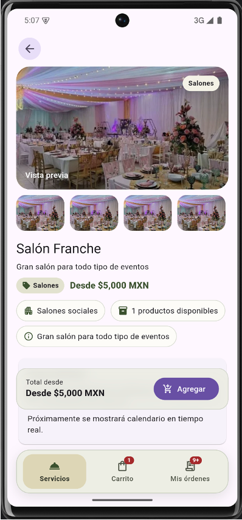<br>Service detail</td>
    <td align="center">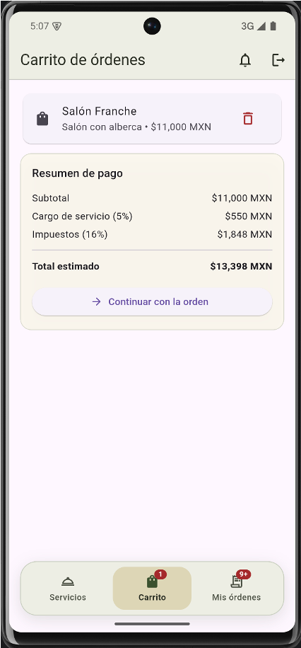<br>Cart</td>
  </tr>
  <tr>
    <td align="center">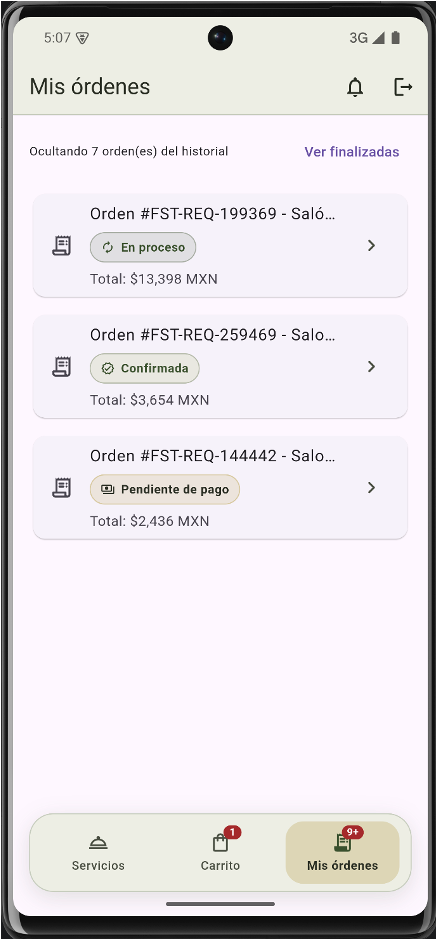<br>Orders</td>
    <td align="center">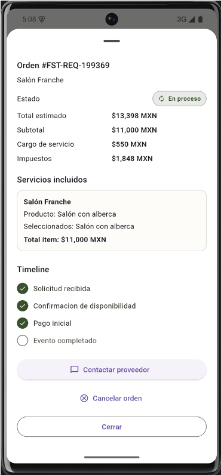<br>Order detail</td>
    <td></td>
  </tr>
</table>

## Architecture

- `lib/features/client`: client-side views, repositories, state, and use cases
- `lib/features/provider`: provider-side dashboard, services, products, and reservations
- `lib/core`: routing, environment configuration, shared services, theme, and networking
- `lib/app`: application shell and route registration

The codebase follows a feature-oriented structure with repositories and use cases separating UI from API integration.

## Configuration

The application supports local and production API environments through `API_BASE_URL`.

Resolution order:

1. `API_BASE_URL` from `--dart-define`
2. Internal defaults by platform and build mode

Current defaults:

- Android emulator: `http://10.0.2.2:8000`
- iOS simulator: `http://127.0.0.1:8000`
- Release builds: `http://18.219.37.43`

Examples:

```bash
flutter run --dart-define=API_BASE_URL=http://10.0.2.2:8000
flutter run --dart-define=API_BASE_URL=http://127.0.0.1:8000
flutter run --dart-define=API_BASE_URL=http://18.219.37.43
```

### Xcode

The iOS project includes multiple build configurations:

- `Debug`
- `Release`
- `Profile`
- `Staging`

Use `Runner` for standard local development and `Runner-Staging` when you want the shared staging scheme.

## Firebase

Android and iOS Firebase configuration files are expected in:

- `android/app/google-services.json`
- `ios/Runner/GoogleService-Info.plist`

Push notifications are fully prepared on Android. For real iOS push notifications on a physical device, Apple Developer Program access and APNs configuration are still required.

## Run

```bash
flutter pub get
flutter run
```

## Validation

```bash
flutter analyze
```

## Platform Scope

This repository is currently focused on mobile delivery:

- Android
- iOS

## Notes

- The local development flow is optimized for emulator and simulator testing.
- The project already integrates real API flows for client and provider modules.
- Image handling supports backend variants with graceful fallback for older payloads.
